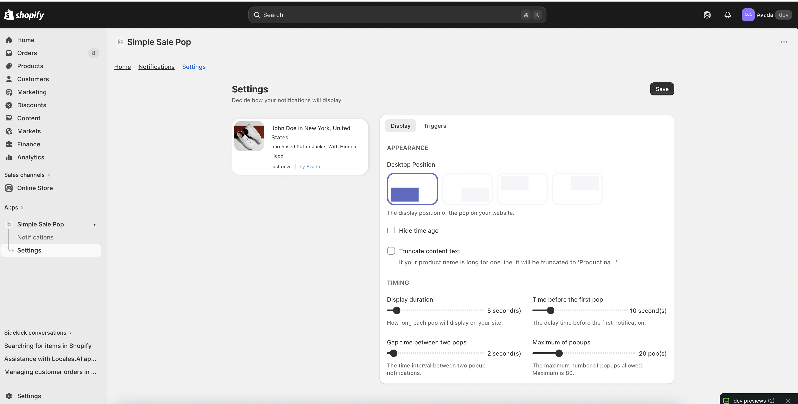

# Simple Sale Pop - Shopify Sales Notification App

Simple Sale Pop is a Shopify embedded app and Theme App Extension that displays real-time style sales notification popups on a merchant's storefront. The app syncs Shopify order data, stores notification records in Firestore, and lets merchants configure how popups are displayed on their store.

## Screenshots

### Popup settings


### Notification list



## Main Features

- Sync recent Shopify orders and convert them into sale notification records.
- Display social-proof popups on the storefront.
- Configure popup position, display duration, first delay, interval, and maximum number of popups.
- Hide time ago text or truncate long product names.
- Control where popups are shown using included/excluded URL rules.
- View and manage synced notification data in the embedded Shopify admin app.
- Automatically create default settings after app installation.
- Listen to Shopify webhooks and process new orders in the background.
- Provide storefront rendering through ScriptTag / Theme App Extension.

## Tech Stack

### Frontend

- React 18
- Vite
- Shopify Polaris
- Shopify App Bridge
- React Router
- React Hooks and Context API
- SCSS/Sass

### Backend

- Node.js 22
- Firebase Cloud Functions v2
- Koa.js / Koa Router
- Firebase Admin SDK
- Firestore
- Google Cloud Pub/Sub
- Google Cloud Tasks
- Cloud Scheduler

### Shopify Integration

- Shopify Admin API
- Shopify GraphQL API
- Shopify Webhooks
- Shopify OAuth
- Shopify Theme App Extension
- Liquid
- Storefront script injection

### Tooling

- Shopify CLI
- Firebase CLI
- Yarn Workspaces
- ESBuild
- ESLint / Prettier
- Jest

## Project Structure

```txt
.
├── packages
│   ├── assets        # React embedded admin app
│   ├── functions     # Firebase Functions backend, API, services, repositories
│   └── scripttag     # Customer-facing storefront popup script
├── extensions
│   └── theme-extension # Shopify Theme App Extension
├── firestore-indexes
├── firestore.rules
├── firebase.json
└── shopify.app.toml
```

## Core Modules

### Admin App

The admin interface is located in `packages/assets`. It includes pages for notification listing and popup settings. Shopify Polaris is used to build a UI that matches the Shopify admin experience.

### Firebase Functions API

The backend is located in `packages/functions`. It exposes APIs for:

- Getting and updating popup settings
- Syncing Shopify orders into notifications
- Listing notification records
- Shopify OAuth
- Shopify webhook handling
- Public widget data for the storefront script

### Storefront Popup Script

The storefront script is located in `packages/scripttag`. It fetches widget data from the public client API and renders notification popups on the merchant storefront according to the configured display rules.

### Background Jobs

The project uses Cloud Tasks and Pub/Sub to process asynchronous work such as syncing new orders and updating notification data without blocking admin requests.

## Installation

### Prerequisites

- Node.js 22
- Yarn 4
- Firebase CLI
- Shopify CLI
- Firebase project
- Shopify Partner account and Shopify app

### 1. Install dependencies

```bash
yarn install
```

### 2. Select Firebase project

```bash
firebase use --add
```

### 3. Configure backend environment

Create `packages/functions/.env` from `packages/functions/.env.example` and update the values:

```dotenv
SHOPIFY_API_KEY=<Shopify API Key>
SHOPIFY_SECRET=<Shopify Secret>
SHOPIFY_FIREBASE_API_KEY=<Firebase API Key>
SHOPIFY_SCOPES=read_themes,read_orders,read_products
SHOPIFY_ACCESS_TOKEN_KEY=avada-apps-access-token
APP_ENV=development
APP_BASE_URL=<Your app base URL>
```

### 4. Configure frontend environment

Create `packages/assets/.env.development` from `packages/assets/.env.example`:

```dotenv
VITE_SHOPIFY_API_KEY=<Shopify API Key>
VITE_FIREBASE_API_KEY=<Firebase API Key>
VITE_FIREBASE_AUTH_DOMAIN=<Firebase Auth Domain>
VITE_FIREBASE_PROJECT_ID=<Firebase Project ID>
VITE_FIREBASE_STORAGE_BUCKET=<Firebase Storage Bucket>
VITE_FIREBASE_APP_ID=<Firebase App ID>
VITE_FIREBASE_MEASUREMENT_ID=<Firebase Measurement ID>
```

### 5. Deploy Firestore rules and indexes

```bash
firebase deploy --only firestore
```

## Development

Run Shopify app development server:

```bash
yarn dev
```

Run Firebase Functions locally:

```bash
GOOGLE_APPLICATION_CREDENTIALS=<path-to-service-account.json> firebase serve
```

Or run the configured emulator script:

```bash
yarn emulators
```

## Build

Build frontend and backend packages:

```bash
yarn predeploy
```

## Deployment

Deploy Firebase services:

```bash
yarn deploy
```

Deploy Shopify app and extension:

```bash
yarn deploy-shopify
```

## Useful Commands

```bash
# Start Shopify development mode
yarn dev

# Start Firebase emulators
yarn emulators

# Build Firestore indexes
yarn firestore:build

# Split Firestore indexes
yarn firestore:split

# Re-sync storefront script
yarn resync-scripttag

# Fix lint issues
yarn eslint-fix

# View Firebase function logs
yarn logs
```

## Notes

This project was built as a side project for learning and practicing Shopify app development, Theme App Extension, Firebase serverless architecture, Firestore, Shopify GraphQL API, webhooks, and storefront widget development.
